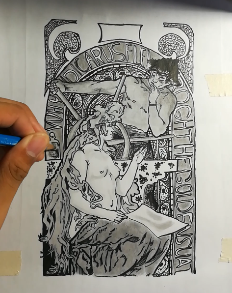

> Tags: [[20250216230014|Artworks]]

I wrote this along with this illustration:

This is part of my example [[20250216224416|writings]].
...
Icarus went on to fly near the delightful sun.  
This is not biting the hand that feeds one.  

What Icarus was looking for is a companion.  
Someone to share his melancholic opinion.  

Projection is, by all means, an act of selfishness.  
That's why the feathers decided to melt away.  
However, the story is not put to rest.  
For Icarus survived to be a castaway.  

Deep within the waters, begging for Daedalus  
Icarus cursed the one King Minos.  
Within fifteen days, between the devil, the labyrinth, and the deep blue sea.  

Icarus caught sight of the master key.  

Icarus saw the lady in white  
His first question is fight or flight?  
By calming the flame into minimal candlelight.  
Icarus starts to recite:  

"For what is the purpose of seeking the golden sun,  
if I can sail on towards a life with a better one?"  

So Icarus sets sail and starts to pray,  
Leaned in and ask the question at bay --  

Hi are u free today?