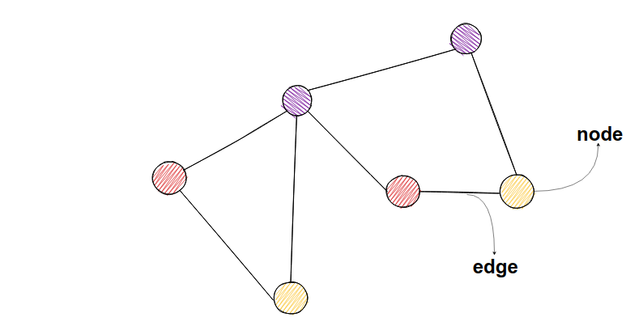

Image taken from: https://memgraph.com/images/blog/introduction-to-node-embedding/memgraph-tutorial-graph-sketch.png

Simply put, it's a manner of representing data through single atomic functional units called **nodes**. In this [[20250216230001|PKM]], each node is a single note, the formed links denote a connection between one's note content and the other. There are no hierarchical order of information, which is similar to how our human brain works!:]
